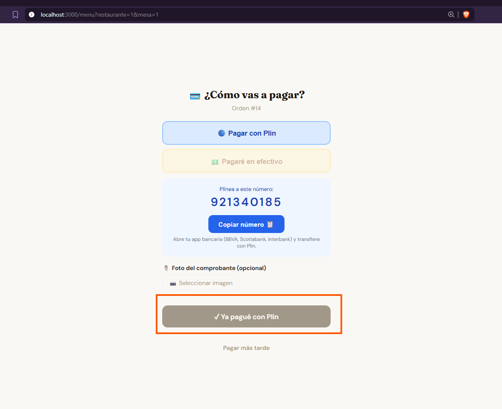

# ISS-002 — Botón "Ya pagué con Plin" aparece deshabilitado en menu.html

**Estado:** resuelto — 2026-05-27  
**Módulo:** Pagos / menu.html (cliente)  
**Reproducible:** a veces  
**Fecha detectado:** 2026-05-21  
**Captura:** [issue_pagos_plin.png](screenshots/issue_pagos_plin.png)

---

## Descripción

En `menu.html`, tras seleccionar "Pagar con Plin" como método de pago, el botón
"✓ Ya pagué con Plin" aparece grisáceo y deshabilitado. El cliente ve el número al
que tiene que plinar y la opción de subir comprobante, pero no puede tocar el botón
para registrar el pago. Ocurre a veces — no siempre.

## Captura

El botón marcado en naranja es "✓ Ya pagué con Plin" — se ve claramente en estado
grisáceo (disabled) cuando debería estar activo.

## Pasos para reproducir (conocidos)

1. Cliente abre `menu.html` (QR del restaurante)
2. Elige platos y confirma el pedido
3. En el paso de pago, selecciona "Pagar con Plin"
4. El panel Plin se despliega (número, instrucciones, upload comprobante)
5. El botón "✓ Ya pagué con Plin" aparece deshabilitado → **cliente no puede continuar**

## Comportamiento esperado

El botón debe estar habilitado desde que el cliente selecciona "Pagar con Plin",
o como máximo después de que el panel Plin termina de renderizarse.

## Comportamiento actual

A veces el botón queda en estado `disabled` y no responde a clics.

## Hipótesis técnica

El botón probablemente tiene `disabled` por defecto y se habilita via JavaScript
cuando el usuario selecciona un método de pago. Si el evento de selección no se
dispara correctamente (timing issue, re-render del DOM, o error JS silencioso),
el botón nunca se habilita.

Posibles causas:
1. El botón se renderiza en el DOM antes de que el listener JS esté atado
2. El estado `disabled` se resetea por algún re-render posterior a la selección
3. Un error JS silencioso interrumpe la función que habilita el botón

## Información necesaria para diagnóstico

Para confirmar la hipótesis:
1. **F12 → Console**: captura en el momento que el botón está grisáceo — buscar errores JS
2. **F12 → Network**: ver si hay requests fallidos al cargar la página de pago
3. **Contexto**: ¿el cliente había interactuado con algo antes de que fallara? ¿es móvil o desktop?

## Archivos involucrados

- `public/menu.html` — lógica del paso de pago y el botón "Ya pagué"
- `routes/public.js` — `PATCH /api/public/pago/orden/:id` y `/pago/reserva/:id`
