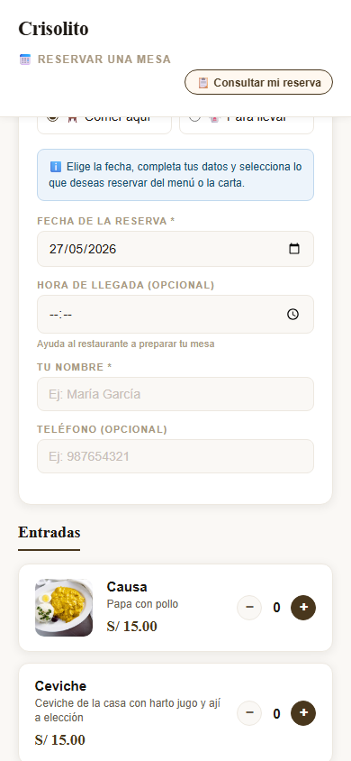
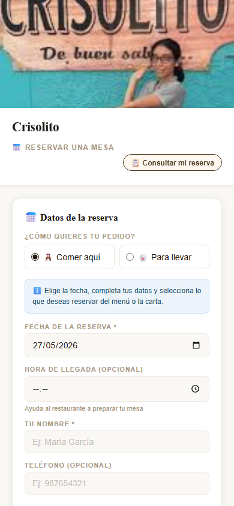
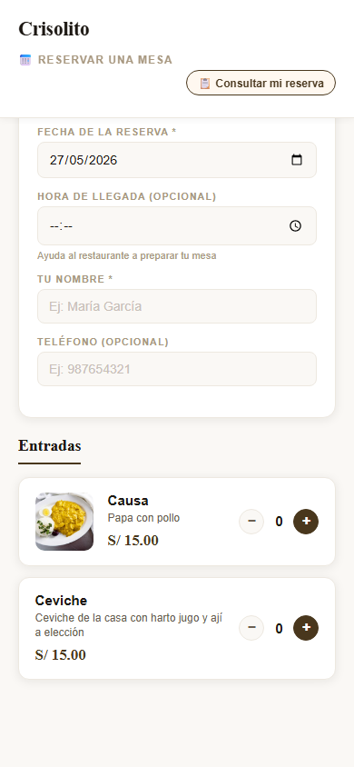
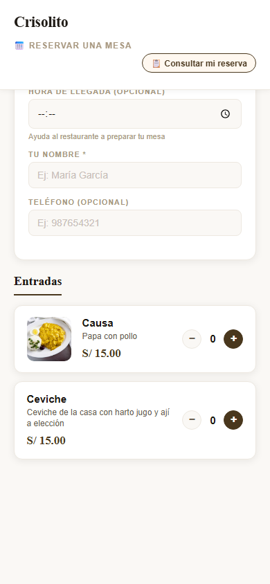
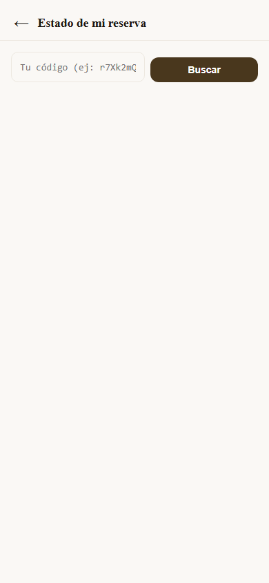

# Guía para el Cliente — Cómo Hacer tu Pedido

*Última actualización: 27 de mayo de 2026*

---

Esta guía es para los **clientes del restaurante**.
No necesitas descargar ninguna app — solo escanea el código QR de tu mesa y listo.
En menos de 2 minutos puedes hacer tu pedido, pagar con Yape y recibir tu código de confirmación.

> 📱 Funciona en cualquier celular con internet. No necesitas crear cuenta.

---

## 1. Menú QR — Pantalla de bienvenida

El cliente escanea el código QR de la mesa y su celular abre el menú del restaurante. Ve la foto del restaurante, el nombre y el menú disponible del día. No necesita descargar ninguna app ni crear una cuenta.

---

## 2. Menú QR — Menú del Día

El menú del día muestra el precio, las secciones disponibles y los platos. Si el menú es **Elegible**, el cliente puede seleccionar qué quiere en cada sección. Si es **Fijo**, el restaurante sirve lo que hay.

---

## 3. Menú QR — Elegir modalidad

El cliente elige cómo quiere recibir su pedido: **Comer en local** (precio base), **Para llevar** (suma el costo del tapper) o **Delivery** si el restaurante lo tiene activado. El precio se actualiza en tiempo real al cambiar la modalidad.

---

## 4. Menú QR — Platos a la Carta

Además del menú del día, el cliente puede agregar **platos a la carta**: ceviche, lomo saltado, bebidas, postres. Cada plato muestra foto, descripción y precio. Puede combinar menú del día con platos a la carta en el mismo pedido.

---

## 5. Menú QR — Confirmar pedido

Al terminar de armar el pedido, el cliente ve el resumen con el detalle y el total. Si pide "para llevar", ve el desglose: precio del menú + cargo del tapper. Puede indicar su nombre y una hora de llegada (opcional).

---

## 6. Menú QR — Paso de Pago

El cliente elige cómo pagar: **Yape**, **Plin** o **Efectivo**. Al tocar "Pagar con Yape", se abre la app de Yape directamente con el número del restaurante pre-cargado. Solo ingresa el monto y confirma. Después toca "Ya pagué" para enviar el comprobante.

---

## 7. Menú QR — Confirmación del Pedido

Tras confirmar el pago, el sistema muestra la confirmación con el código de reserva. El cliente guarda el código (screenshot) y lo presenta al llegar al restaurante. Desde el menú QR también puede consultar el estado de su pedido en tiempo real.

---

## 8. Menú QR — Consultar estado del pedido

El cliente puede revisar el estado de su reserva en cualquier momento ingresando su código. El estado se actualiza automáticamente: Confirmada → En Preparación → Listo → Entregado.

---

