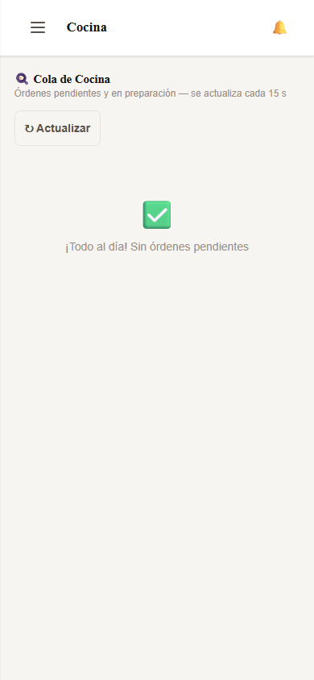

# Manual de Usuario — Cocinero

*Última actualización: 27 de mayo de 2026*

---

Este manual está dirigido al **cocinero o cocinera** del restaurante.
El sistema te muestra todos los pedidos que hay que preparar, ordenados por urgencia.
Solo necesitás saber marcar un pedido como "Listo" — el resto lo hace el sistema.

> 💡 Pedile al dueño del restaurante que te cree un usuario con el rol "Cocinero".

---

## 1. Panel de Cocina — Vista principal

Al ingresar como cocinero, el sistema muestra directamente el **panel de cocina** con todos los pedidos activos ordenados por urgencia. No hay acceso a configuración ni reportes — solo lo que necesitás para trabajar.

---

## 2. Cola de Cocina — Pedidos en preparación

La cola muestra **órdenes y reservas juntas**. Las reservas tienen hora de llegada y se marcan en azul para diferenciarlas. Al terminar de preparar un pedido, toca el botón **"🍽 Listo"** para notificar al mozo.

---

## 3. Cola de Cocina — Más pedidos

Si hay muchos pedidos, haz scroll para ver todos. El panel se actualiza automáticamente cada 15 segundos — si llega un pedido nuevo, un sonido de alerta te avisa.

---

