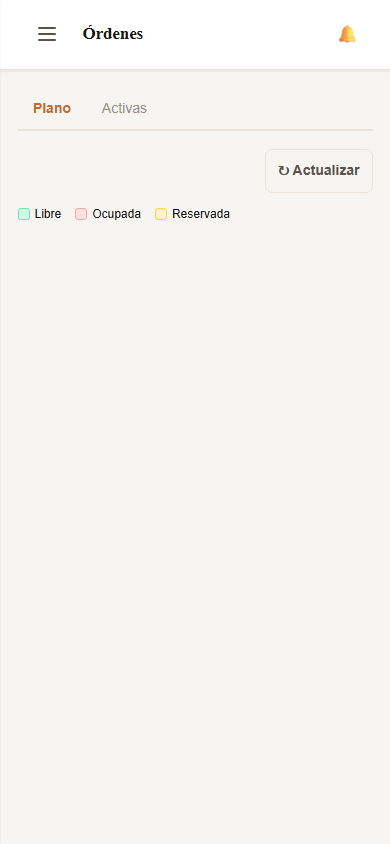
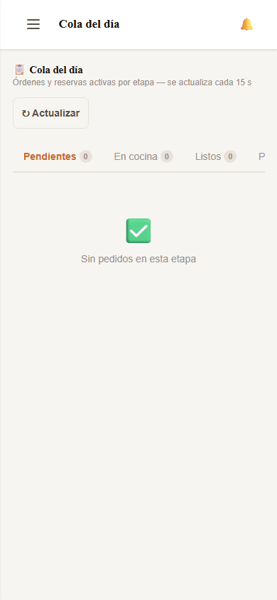
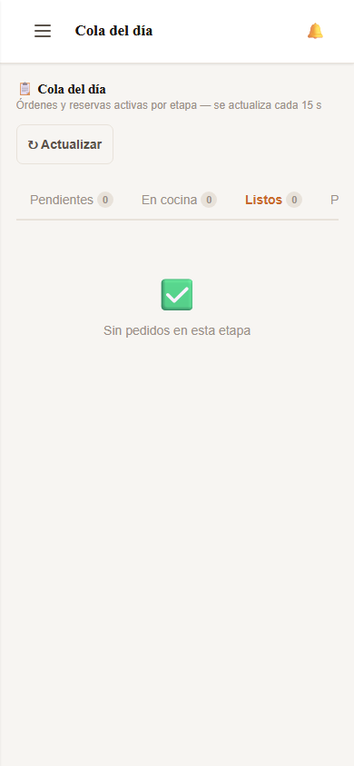
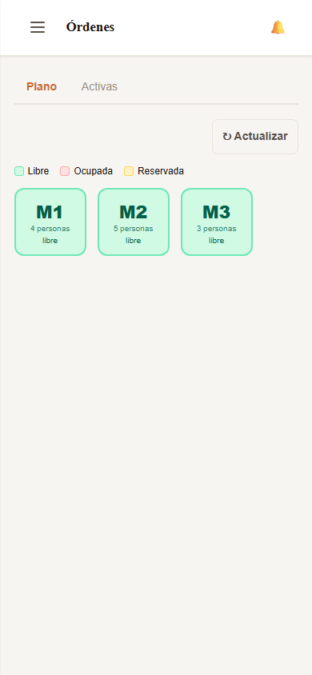

# Manual de Usuario — Mozo / Cajero

*Última actualización: 27 de mayo de 2026*

---

Este manual está dirigido al **mozo o cajero** del restaurante.
Verás el plano de mesas en tiempo real y la cola de pedidos con el detalle exacto
de qué plato va a qué mesa. El sistema elimina la confusión y los errores de entrega.

> 💡 Pedile al dueño que te asigne los permisos: "Mesas", "Cola del día" y "Reservas activas".

---

## 1. Panel del Mozo — Vista inicial

El mozo ingresa al sistema con su propio usuario y ve solo los módulos que necesita: el plano de mesas y la cola del día. El sistema vive en su celular — lo tiene en la mano durante todo el turno.

---

## 2. Cola del Día — Vista del Mozo

La **Cola del Día** le muestra al mozo exactamente qué plato va a qué mesa. "Mesa 3 — Lomo saltado — Reserva r7Xk2mQ". Sin adivinar. Sin confundirse. El badge de cada tab indica cuántos pedidos hay en esa etapa.

---

## 3. Cola del Día — Platos Listos para entregar

Cuando el cocinero marca un plato como listo, aparece en esta zona. El mozo toca **"🍽 Entregar"** cuando lleva el plato a la mesa, y el pedido pasa automáticamente a **"Por Cobrar"**.

---

## 4. Plano de Mesas

El plano muestra el estado de cada mesa en tiempo real. 🟢 **Libre** — puedes sentar a clientes. 🟠 **Ocupada** — hay una orden activa. 🔵 **Reservada** — tiene una reserva confirmada con hora de llegada próxima. Toca cualquier mesa para ver los detalles y cobrar.

---

