# Manual de Usuario — Dueño del Restaurante (Owner)

*Última actualización: 27 de mayo de 2026*

---

Este manual está dirigido al **dueño o administrador** del restaurante.
Cubrimos todas las funciones del sistema: desde configurar el menú del día hasta
revisar reportes de ganancias y gestionar tu equipo.

> 💡 El sistema funciona como una app en tu celular. Abre el navegador, ingresa a la
> URL del sistema y toca "Instalar" para agregarlo a tu pantalla de inicio.

---

## 1. Pantalla de inicio de sesión

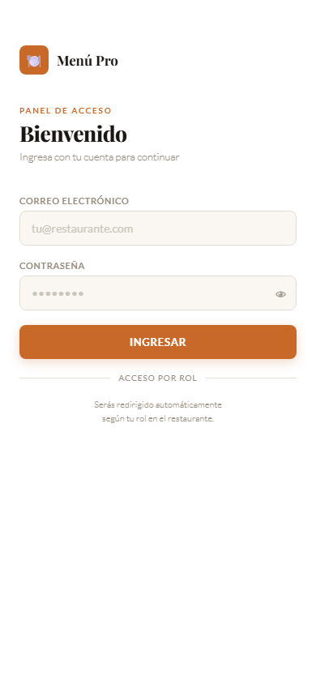

Accede al sistema desde tu celular ingresando tu correo y contraseña. El sistema funciona como una app instalable — puedes agregarlo a tu pantalla de inicio desde el navegador.

---

## 2. Panel principal — Menú del Día

Al ingresar, el sistema muestra el panel de **Menú del Día** con los menús activos de hoy. Desde el menú lateral puedes navegar a cualquier módulo del sistema.

---

## 3. Módulo Menú del Día — lista de menús

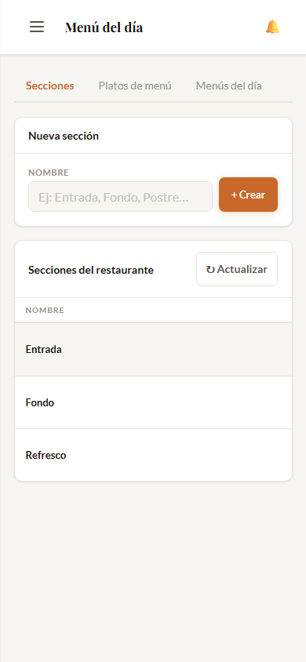

Aquí creas y gestionas los menús del día. Puedes tener varios menús activos al mismo tiempo (ej: Menú Universitario + Menú Ejecutivo). Cada menú tiene su precio y modalidades habilitadas.

---

## 4. Módulo Menú del Día — secciones y platos

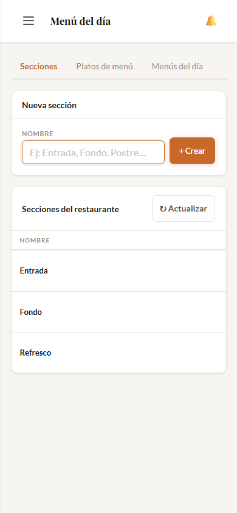

Dentro de un menú puedes configurar las **secciones** (Entrada, Fondo, Postre, Refresco) y asignar los **platos** a cada sección. Marca una sección como "Obligatoria" para que el precio del menú la incluya siempre.

---

## 5. Módulo Carta — categorías

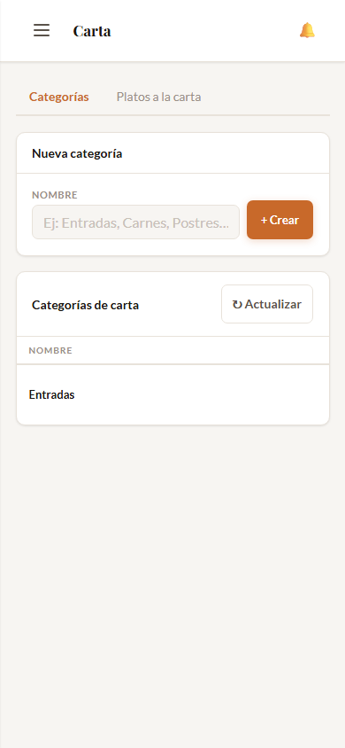

La carta contiene los platos individuales que vendes aparte del menú del día: ceviche, lomo saltado, causa, bebidas, etc. Primero crea las **categorías** (Entradas, Platos fuertes, Postres, Bebidas).

---

## 6. Módulo Carta — platos

Dentro de una categoría puedes agregar los platos con nombre, precio y foto. El toggle "Activo/Inactivo" te permite ocultar temporalmente un plato del menú QR sin borrarlo (ej: si se agotó).

---

## 7. Cola del Día — tab Pendientes

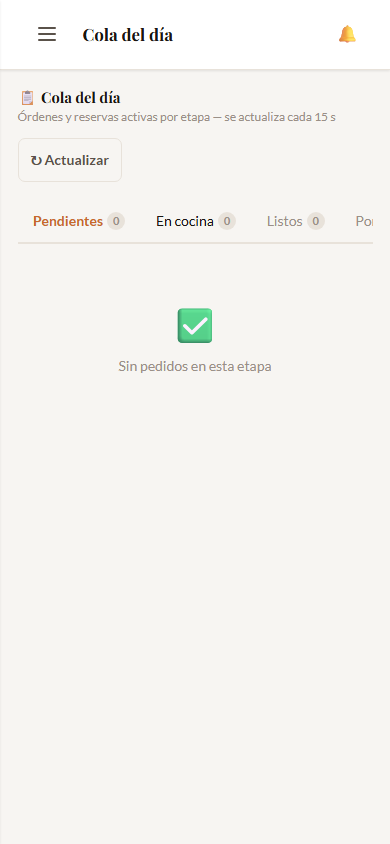

La **Cola del Día** es el centro de operaciones. Muestra todas las órdenes y reservas activas organizadas en 4 zonas: Pendientes, En Cocina, Listos y Por Cobrar. El badge naranja indica cuántos pedidos hay en cada zona.

---

## 8. Cola del Día — tab En Cocina

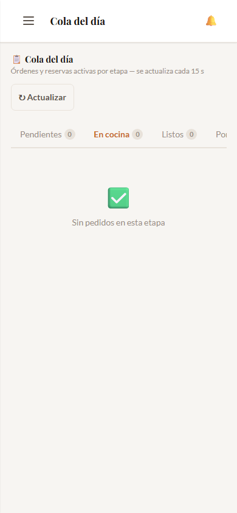

En la zona **En Cocina** ves los pedidos que están siendo preparados. Cada tarjeta muestra qué pidió el cliente, la mesa o código de reserva, y los botones de acción para avanzar al siguiente estado.

---

## 9. Módulo Órdenes — Plano de Mesas

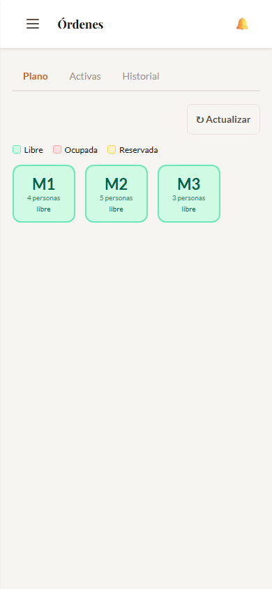

El plano de mesas muestra el estado actual de cada mesa en tiempo real. 🟢 Verde = libre, 🟠 Naranja = ocupada, 🔵 Azul = reserva confirmada. Toca una mesa ocupada para ver los detalles de la orden activa.

---

## 10. Módulo Órdenes — Historial

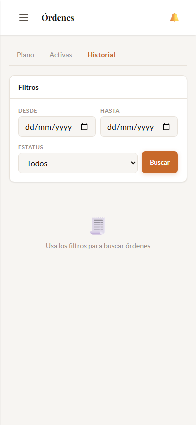

El historial guarda todas las órdenes completadas y canceladas. Podés filtrar por fecha y descargar el reporte en Excel con un solo toque.

---

## 11. Módulo Reservas — Activas

Aquí ves las **reservas del día** — pedidos anticipados que los clientes hacen desde el menú QR. Cada reserva muestra el código único (ej: r7Xk2mQ), la hora de llegada, qué pidió el cliente y el estado actual. Las reservas con pago pendiente muestran el badge ⚠️.

---

## 12. Módulo Reservas — Historial

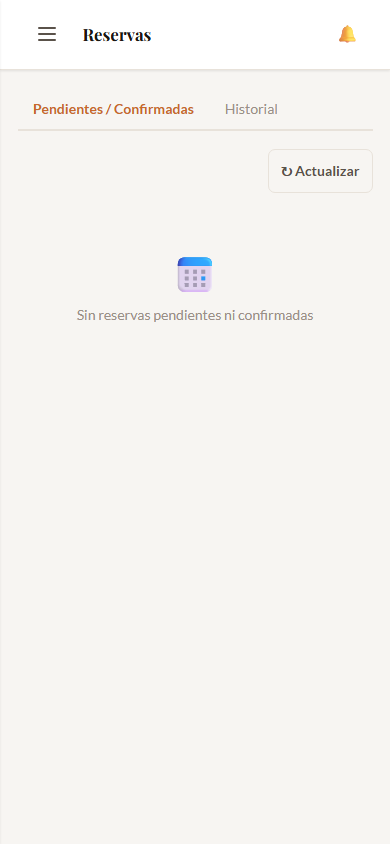

El historial de reservas muestra todas las reservas completadas y canceladas. Podés descargar el reporte en Excel para llevar el control de ingresos por reservas.

---

## 13. Módulo Cocina — Cola unificada

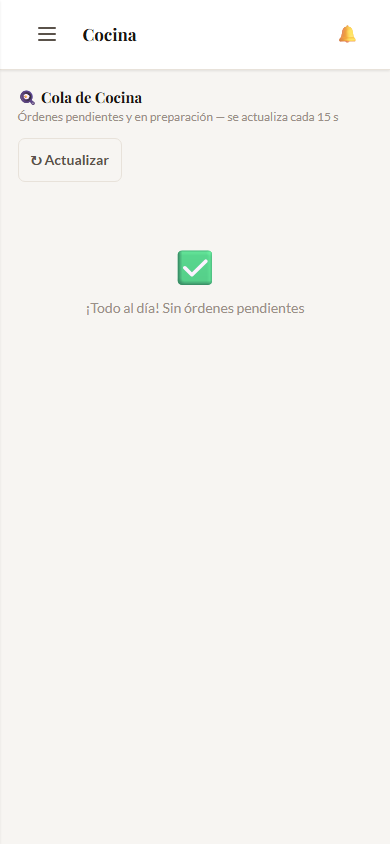

El panel de cocina muestra **órdenes y reservas juntas** ordenadas por urgencia. Las reservas aparecen primero si su hora de llegada está próxima. El cocinero marca cada pedido como "Listo 🍽" cuando termina de prepararlo.

---

## 14. Módulo Reportes — Curva de Demanda

Los reportes te muestran en qué días y horarios viene más gente. La curva de demanda ayuda a planificar cuánto menú preparar cada día y cuándo necesitás más personal.

---

## 15. Módulo Reportes — Ganancias

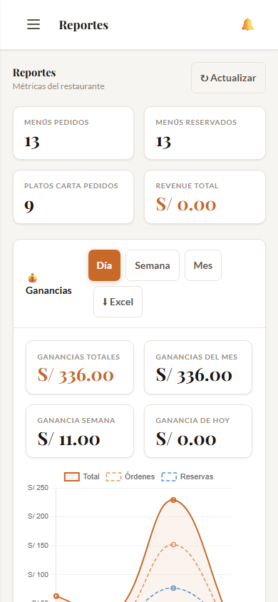

La sección de ganancias muestra el ingreso total, por período y desglosado entre órdenes y reservas. Podés descargar el reporte en Excel para tu contabilidad.

---

## 16. Módulo Configuración — Datos del restaurante

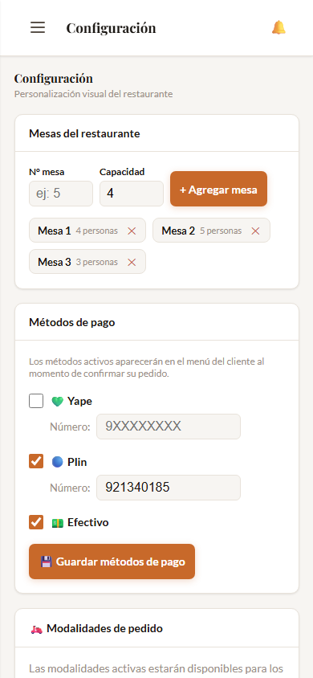

En configuración personalizás la apariencia que verán tus clientes: foto de portada del menú QR, color de marca, nombre del restaurante y el tiempo de preparación para las reservas (cuántos minutos antes pasan a cocina automáticamente).

---

## 17. Módulo Configuración — QR y Métodos de Pago

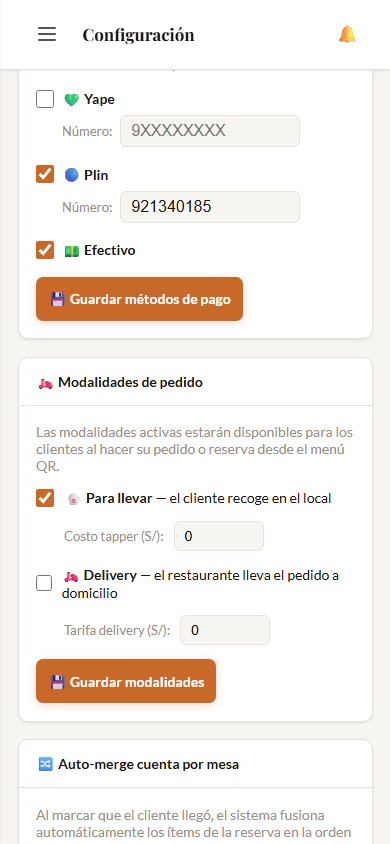

El **código QR** de tu menú se genera automáticamente — descárgalo e imprímelo en cada mesa. En **Métodos de pago** activa Yape, Plin y Efectivo. Solo ingresa tu número de teléfono y tus clientes podrán yapear directamente desde el menú.

---

## 18. Módulo Usuarios — Lista de usuarios

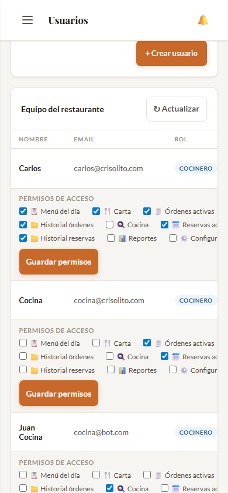

Aquí creas las cuentas de tu equipo: cocineros y mozos. Cada usuario solo ve las partes del sistema que necesita para su trabajo.

---

## 19. Módulo Usuarios — Crear usuario

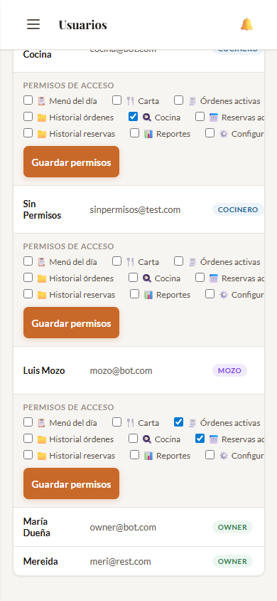

Al crear un usuario asigna su rol (Cocinero o Mozo) y los **permisos granulares** que tendrá: qué módulos puede ver y qué acciones puede hacer. Un mozo con permiso "Cola del día" puede gestionar pedidos desde su celular.

---

